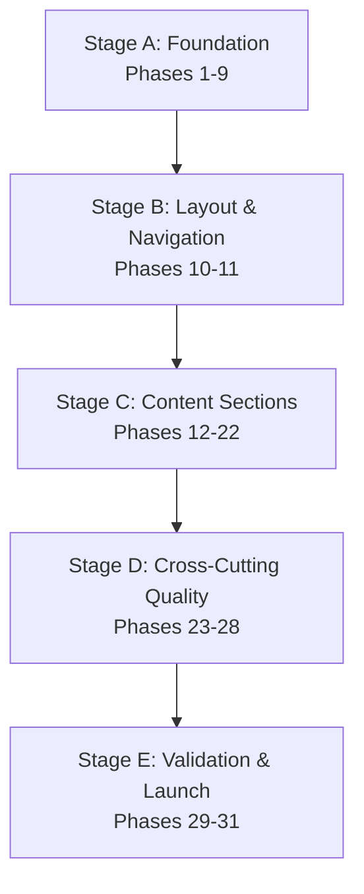

# Portfolio Website — Final Implementation Plan

**Prepared for:** Anas · **Version:** 1.0 (Final Master Document) · **Scope:** Implementation planning only — no source code, no design changes, no architecture changes

---

## 1. Purpose

This roadmap sequences the build described in the seven approved documents (*Project Specification*, *UI Design System*, *Design Inspirations*, *Design Document v2.0*, *Front-End Architecture Specification*, *Website Content Specification*, and *Design Principles*) into a strict execution order. 

It treats these source documents as final and unchanged. Nothing here redesigns a screen, alters the established folder structure, or invents content. Its sole purpose is to sequence the engineering tasks: what gets built in what order, why that order is correct, what dependencies exist between tasks, and what a lead engineer must verify before writing code. 

Where the source documents contain discrepancies or internal gaps, they are surfaced in **Section 2 (Project Readiness Review)** rather than silently resolved, serving as decisions for Anas before those specific implementation phases begin.

---

## 2. Project Readiness Review

### 2.1 Guiding Constraints (Recap, Not Redesign)
To ensure the implementation aligns with the architectural rules established across the specification files, the following constraints must be strictly adhered to:
* **Architecture:** Single-page site, hash-based routing for the Project Detail view, no database/backend, no build step, and no bundler.
* **Technology:** Vanilla HTML5, CSS3, ES6 modules, JSON data, and SVG icons/graphics only.
* **Separation of Concerns:** Strict division between content (`/data/` JSON files), behavior (`/js/` modules), and appearance (`/css/` stylesheets).
* **Bilingual Support:** Full English (EN) and Arabic (AR) support, RTL/LTR switching, no-page-reload language toggling, browser-detected default, and persisted manual settings via `localStorage`.
* **Detail Views:** No popup modals for projects; a dedicated in-site Project Detail view with a shared-element transition (or cross-fade fallback).
* **Navigation:** The global navigation menu excludes the "About" section by design. The language toggle is a fixed meta-control, not a mirrored nav link.
* **Restraint:** No skill bars, stars, percentages, timelines, animated counters, video backgrounds, or mouse-follow visual effects.
* **Quality Targets:** Lighthouse score target of 95+ across all categories; WCAG-grade accessibility as a core requirement rather than an enhancement.

### 2.2 Pre-Flight Findings & Consistency Checks
The source files and assets have been audited against the conventions committed to in the *Architecture Specification*. The following findings must be addressed prior to or during their respective phases:

| # | Finding | Affected Phase | Recommended Handling & Resolutions |
|---|---|---|---|
| **1** | **Fragile PDF Filenames:** Both CV files (`Anas_Alrayes_CV_AR.pdf` and `Anas_Alrayes_CV_EN.pdf`) contain invisible Unicode right-to-left mark characters at the start. This causes fragile URLs, incorrect `documents.json` references, and Git issues. | **Phase 3** (Asset Prep) | Rename files to ASCII-safe conventions specified in the Architecture Spec: `resume-ar.pdf` and `resume-en.pdf`. This is a rename, not a content change. |
| **2** | **Project Image Formats & Naming:** Source screenshots are raw `.jpg`/`.png` files (`1.jpg`, `2.jpg`, etc.) rather than the `cover.webp` / `gallery-01.webp` formats/naming defined in §6. FileFusion has 2 source images, ShorKer has 3, and SalatApp has 1. | **Phase 3** (Asset Prep) | Convert images to WebP and rename according to the §6 convention. Note: FileFusion is the flagship project requiring a full Gallery block; 2 source images is low. The template's graceful omission logic will handle this, but Anas should confirm if more assets are available. |
| **3** | **Unreferenced QR Code Assets:** `/assets/qr/qrcode.png` and `qrcode.svg` exist in the files but are not mentioned in any of the specification docs. | **Phase 21** (Contact) | The *Website Content Specification* states that the implementation must not invent content. Query Anas if this QR asset is intended as a Contact-section "scan to connect" addition. Default assumption: **excluded** unless confirmed. |
| **4** | **Document Page Count Requirement:** The Content Specification requires document entries to display page counts. | **Phase 6** (Data Layer) | The actual page counts have been verified directly from the source files: Arabic CV (1 page), English CV (1 page), Supporting Portfolio (15 pages). Hardcode these real values into `documents.json`. |
| **5** | **Architecture Spec `index.json` Gap:** §4 of the Architecture Spec shows `index.json` containing only `slug` and `featured` fields. However, §8's bootstrap sequence requires rendering gallery cards (which need covers, titles, descriptions, and tags) *before* fetching per-project detail JSON files. Eager fetching defeats the lazy-loading strategy of §13, while hardcoding cards in `index.html` violates bilingual data separation. | **Phase 6** (Data Layer) | **Resolution:** Extend each `index.json` entry with summary fields: `cover`, `title {en, ar}`, `shortDescription {en, ar}`, and `technologies`. This keeps the "one project = one JSON file" detail-loading strategy intact while supplying the gallery card with localized content from a single data source. |

### 2.3 Open Questions & Conflicts (Where Source Docs Disagree)
The following conflicts between source documents must be resolved with Anas prior to executing the phases that depend on them:

#### 0.1 — Missing Design Tokens (Blocks Phase 4)
* **Conflict:** *Design Document v2.0* states it carries forward the color palette, spacing scale, type scale, and Latin font pairing from a *v1.0 design document*. The v1.0 document is missing; only the v2.0 addendum and the general *UI Design System* document are present. The UI Design System outlines the color philosophy ("white / off-white / dark charcoal / soft gray, one accent color") but lacks exact hex codes, spacing/type scale values, or specific Latin font names.
* **Why it matters:** Phase 4 (CSS tokens) is the foundation of the entire visual layer. Building with placeholder tokens risks a full refactoring pass later.
* **Recommendation:** Locate the v1.0 design document, or have Anas confirm final hex, scale, and font values. Phase 4 can proceed with token structure setup, but final values must be locked before component styling begins.

#### 0.2 — Hero Section Stats: 4 Items vs. 5 Items (Blocks Phase 12)
* **Conflict:** *Project Specification §10* specifies exactly four numeral-led stats for the Hero section (99.44%, 235+, 3, 4th). The *Website Content Specification* lists five items, two of which are short phrases rather than numbers ("Multiple National Achievements", "Jeddah, Saudi Arabia"). *Design Document v2.0 §5* references the 4-item visual treatment from v1.0.
* **Why it matters:** The editorial numbers row is a strict visual pattern. Mixed types break the layout rhythm.
* **Recommendation:** Default to the *Project Specification* 4-item numeral-only version, placing location information in the Footer/Contact sections where the Content Spec independently places it.

#### 0.3 — Skills Categories: 3 Categories vs. 7 Categories (Blocks Phase 18)
* **Conflict:** *Design Document v2.0 §10* defines a 3-category Skill Matrix (Programming Languages, Development Focus, Tools) with pre-assigned tags. The *Website Content Specification* lists 7 categories without assigned tags. *Project Specification §14* lists flat, uncategorized tags.
* **Why it matters:** The grid layout column alignment depends on a low, stable category count.
* **Recommendation:** Default to the 3-category matrix from *Design Document v2.0*, as it is the most recent layout-aware specification.

#### 0.4 — Minor Content & Schema Gaps (Each Blocks one Section Phase)
* **Footer Copy:** The *Content Spec* asks for a "Copyright" notice, but *Design Doc v2.0 §14* replaces the copyright bar with a personal sign-off sentence + "Anas · [year]" and rules out "All rights reserved." **Recommendation:** Prioritize the v2.0 design (sign-off + mark). *Affects Phase 22.*
* **Documents Page Count Schema:** The *Content Spec* requires page counts, but the *Architecture Spec's* `documents.json` schema lacks a field for it. **Recommendation:** Add a `pageCount` field to the schema. *Affects Phase 20.*
* **Achievements Detail Accordion:** The *Content Spec* mentions optional expansion for achievements, but *Design Doc v2.0* shows a flat list, and the *Architecture Spec* lacks an accordion JS module. **Recommendation:** Render achievements as a flat list; defer accordion mechanics unless requested. *Affects Phase 17.*
* **Hero Secondary Button Target:** The secondary CTA is "Download CV," but the site hosts two CVs (EN/AR). **Recommendation:** Dynamically point to the PDF matching the current site language. *Affects Phase 12.*

---

## 3. Implementation Roadmap

### 3.1 Stage Map
The roadmap is divided into five progressive stages. Each stage represents a stable checkpoint.

### 3.2 Phase Overview

| # | Phase | Complexity | Depends On |
|---|---|---|---|
| **1** | Environment & Repository Initialization | Low | None |
| **2** | Folder & File Scaffolding | Low | Phase 1 |
| **3** | Asset Preparation Pipeline | Medium | Phase 2 |
| **4** | CSS Foundation Layer (Design Tokens, Reset, Typography) | Medium* | Phase 3 (+ §0.1) |
| **5** | Static HTML Shell & Document Head | Low–Medium | Phase 2, Phase 4 |
| **6** | Core Content Data Layer (JSON Data Layer) | Low–Medium | Phase 2, Phase 3 (+ §0.4, Pre-Flight #5) |
| **7** | Shared JS Utilities | Low–Medium | Phase 2 |
| **8** | App Bootstrap & Init Sequence | Medium | Phase 5, Phase 6, Phase 7 |
| **9** | Localization Engine / Localization System | High | Phase 6, Phase 7, Phase 8 |
| **10** | Base Layout | Low–Medium | Phase 4, Phase 5 |
| **11** | Header / Navigation + Footer Skeleton | Medium | Phase 4, Phase 5, Phase 8, Phase 9, Phase 10 |
| **12** | Hero Section | Medium* | Phase 4, Phase 5, Phase 8, Phase 9 (+ §0.2, §0.4) |
| **13** | About Section | Low | Phase 4, Phase 5, Phase 8, Phase 9 |
| **14** | Projects Data Schema & Gallery View | Medium | Phase 4, Phase 7, Phase 8, Phase 9 |
| **15** | Project Detail View & Hash Routing | Very High | Phase 14 |
| **16** | Image Gallery / Lightbox | Medium | Phase 15 |
| **17** | Achievements Section | Low–Medium* | Phase 4, Phase 7, Phase 8, Phase 9 (+ §0.4) |
| **18** | Skills Matrix Section | Medium* | Phase 4, Phase 7, Phase 8, Phase 9 (+ §0.3) |
| **19** | Current Focus Banner | Low | Phase 4, Phase 6, Phase 8, Phase 9 |
| **20** | Documents Section | Low* | Phase 3, Phase 4, Phase 7, Phase 8, Phase 9 (+ §0.4) |
| **21** | Contact Section | Low | Phase 4, Phase 6, Phase 8, Phase 9 |
| **22** | Footer (Content Finalization) | Low* | Phase 11 (+ §0.4) |
| **23** | Animation & Motion Layer / System | Medium–High | Phase 11–22 (All sections built) |
| **24** | Accessibility Hardening Pass | High | Phase 23 |
| **25** | Responsive Implementation Pass | Medium–High | Phase 11–23 |
| **26** | Content & Asset Production | Medium | Phase 14, Phase 17, Phase 18, Phase 20 |
| **27** | Performance Optimization Pass | Medium | Phase 23–26 |
| **28** | SEO Finalization | Low–Medium | Phase 5, Phase 26 |
| **29** | Testing & Quality Assurance | Medium–High | Phase 24–28 |
| **30** | Final Design Polish | Medium | Phase 29 |
| **31** | Deployment Readiness | Low | Phase 30 |

*\*Marked phases are gated by unresolved items in Section 2.*

---

### 3.3 Detailed Phase-by-Phase Roadmap

#### STAGE A — FOUNDATION

##### Phase 1: Environment & Repository Initialization
* **Goal / Purpose:** Establish the working repository under version control, configured for a static environment with no build steps, targeting GitHub Pages.
* **Files Involved:** Repository root, `.gitignore`, `README.md` (initial stub), `.nojekyll`.
* **Dependencies:** None.
* **Deliverables & Expected Output:** A configured git repository. The presence of `.nojekyll` ensures GitHub Pages does not run Jekyll processing on files.
* **Testing Checkpoints:** Clone repository; verify that pushing an empty structure triggers a successful GitHub Pages build.
* **Complexity:** Low.
* **Sequencing Rationale:** Standard starting point. Setting up static hosting assumptions early avoids hosting-specific configuration issues during deployment.

##### Phase 2: Folder & File Scaffolding
* **Goal / Purpose:** Implement the directory layout outlined in the *Architecture Specification §3* to set up placeholders before writing content.
* **Files Involved:** `/assets/images/projects/{filefusion,shorker,salatapp}/`, `/assets/images/site/`, `/assets/icons/`, `/assets/fonts/`, `/assets/documents/`, `/data/`, `/data/i18n/`, `/data/projects/`, `/css/base/`, `/css/layout/`, `/css/components/`, `/css/utilities/`, `/css/animations/`, `/js/core/`, `/js/modules/`, `/js/utils/`.
* **Dependencies:** Phase 1.
* **Deliverables & Expected Output:** Navigable empty directory tree matching the spec.
* **Testing Checkpoints:** Verify folder structures on disk; confirm all directories match naming conventions.
* **Complexity:** Low.
* **Sequencing Rationale:** Creating the directory layout up front ensures all subsequent work remains purely additive and avoids paths mismatch.

##### Phase 3: Asset Preparation Pipeline
* **Goal / Purpose:** Prepare all project images and document downloads. Resolve Pre-Flight Findings #1 and #2. Convert project screenshots to WebP, rename PDFs to ASCII-safe values, self-host and subset fonts, and compile icons.
* **Files Involved:** `/assets/images/projects/*`, `/assets/fonts/*`, `/assets/icons/*`, `/assets/documents/*`.
* **Dependencies:** Phase 2.
* **Deliverables & Expected Output:** Optimized WebP screenshots under correct filenames, ASCII-safe CV PDFs, font subsets (Latin Sans, Latin Serif Accent, Arabic Sans, Arabic Naskh Accent), and a single unified SVG sprite sheet.
* **Testing Checkpoints:** Verify all images load; check font subset rendering for Arabic and Latin scripts; ensure PDFs open cleanly via their new names (`resume-ar.pdf`, `resume-en.pdf`).
* **Complexity:** Medium (manual steps).
* **Sequencing Rationale:** Pre-processing assets avoids refactoring files and links later when the CSS and data templates reference them.

##### Phase 4: CSS Foundation Layer (Design Tokens, Reset, Typography)
* **Goal / Purpose:** Create the baseline stylesheet, styling tokens (colors, spacing, and typography scales), base typography, and the imports chain.
* **Files Involved:** `css/base/reset.css`, `css/base/tokens.css`, `css/base/typography.css`, `css/main.css`.
* **Dependencies:** Phase 3. Blocked on **§0.1** for final values.
* **Deliverables & Expected Output:** A token sheet defining variables. Imports are managed in `css/main.css` per Architecture §9.
* **Testing Checkpoints:** Load CSS tokens against a dummy page. Verify color variables, type scale, line heights, and typography stacks for Arabic and Latin render.
* **Complexity:** Medium (blocked on §0.1).
* **Sequencing Rationale:** Establishes variables to prevent components from hardcoding colors or spacing, facilitating future dark-mode switches (Architecture §9).

##### Phase 5: Static HTML Shell & Document Head
* **Goal / Purpose:** Create `index.html` with basic structural semantic sections, skip links, and initial meta tags.
* **Files Involved:** `index.html`, `manifest.json`, `favicon.ico`, `robots.txt`, `sitemap.xml`.
* **Dependencies:** Phase 2, Phase 4.
* **Deliverables & Expected Output:** Semantic skeleton page featuring landmark tags (`nav`, `main`, `section`, `footer`) and a functioning keyboard skip link.
* **Testing Checkpoints:** Open index.html; verify landmarks are detectable via screen reader; ensure keyboard tab key focuses first on the skip link.
* **Complexity:** Low–Medium.
* **Sequencing Rationale:** Structural section wrappers must exist in static HTML to ensure SEO crawlability (Architecture §11) before JS dynamically populates them.

##### Phase 6: Core Content Data Layer (JSON Data Layer)
* **Goal / Purpose:** Establish the JSON-based data layer. Resolve Pre-Flight Findings #4 and #5.
* **Files Involved:** `/data/site.json`, `/data/i18n/en.json`, `/data/i18n/ar.json`, `/data/projects/index.json` (with extended summary fields), `/data/projects/{filefusion,shorker,salatapp}.json`, `/data/achievements.json`, `/data/skills.json`, `/data/documents.json` (with real page counts).
* **Dependencies:** Phase 2, Phase 3.
* **Deliverables & Expected Output:** All site copy, project metadata, CV links, achievements list, and translations localized in JSON files.
* **Testing Checkpoints:** Verify JSON files parse correctly. Test fetch requests in console: `fetch('./data/site.json').then(r => r.json())`.
* **Complexity:** Low–Medium.
* **Sequencing Rationale:** Decouples content from logic. Later components will consume this data, keeping templates bilingual and easily updateable.

##### Phase 7: Shared JS Utilities
* **Goal / Purpose:** Create shared utility helpers to prevent code duplication in modules.
* **Files Involved:** `js/utils/dom.js`, `js/utils/fetchJSON.js`, `js/utils/i18n.js`.
* **Dependencies:** Phase 2.
* **Deliverables & Expected Output:** Cached JSON fetcher, string resolver helper, and basic DOM manipulation helpers.
* **Testing Checkpoints:** Call `fetchJSON` multiple times in console and verify caching; test language fallback resolution using `i18n.js`.
* **Complexity:** Low–Medium.
* **Sequencing Rationale:** Reusable helpers must exist before writing modular rendering logic to prevent duplication of fetch and localization methods.

##### Phase 8: App Bootstrap & Init Sequence
* **Goal / Purpose:** Write the core application loop in `core/app.js` to run the 5-step init sequence (Architecture §8).
* **Files Involved:** `js/core/app.js`, `js/core/state.js`.
* **Dependencies:** Phase 5, Phase 6, Phase 7.
* **Deliverables & Expected Output:** Core bootstrap flow that initializes the state, loads JSON files, sets the default page lang, and renders shell text.
* **Testing Checkpoints:** Check that site data, translation strings, and projects index load in parallel (network tab). Verify console shows no errors.
* **Complexity:** Medium.
* **Sequencing Rationale:** Centralizes the initialization sequence so all modules hook into a single-source-of-truth loading flow.

##### Phase 9: Localization Engine / Localization System
* **Goal / Purpose:** Write the localization toggle system. Manage HTML attribute changes, local persistence, cross-fade animations, and RTL style overlays.
* **Files Involved:** `js/modules/language.js`, `css/rtl.css`.
* **Dependencies:** Phase 6, Phase 7, Phase 8.
* **Deliverables & Expected Output:** Non-reloading localization engine that updates `lang`/`dir`, switches typography, resolves strings, and applies RTL layout changes.
* **Testing Checkpoints:** Click language toggle: check that HTML `dir` switches between `ltr`/`rtl` and `lang` switches between `en`/`ar`; check that font stacks update correctly and selection persists on page refresh.
* **Complexity:** High (RTL mirror details).
* **Sequencing Rationale:** Setting up localization before building sections ensures all components are built bilingual from the start.

---

#### STAGE B — LAYOUT & NAVIGATION

##### Phase 10: Base Layout
* **Goal / Purpose:** Set up the page grid, viewport constraints, and vertical spacing margins for section containers.
* **Files Involved:** `css/layout/grid.css` or layout stylesheets inside `css/layout/`.
* **Dependencies:** Phase 4, Phase 5.
* **Deliverables & Expected Output:** Global layout stylesheet enforcing a consistent spacing scale and scroll rhythm.
* **Testing Checkpoints:** Verify layout spacing looks correct and functions responsively across device sizes using placeholder sections.
* **Complexity:** Low–Medium.
* **Sequencing Rationale:** Dictates section margins and structural grid patterns before styling individual sections.

##### Phase 11: Header / Navigation + Footer Skeleton
* **Goal / Purpose:** Build the navigation bar, hamburger menu, overlay logic, scrollspy indicator, and a basic footer outline container.
* **Files Involved:** `js/modules/nav.js`, `css/layout/header.css`, `css/layout/footer.css`, `css/components/nav.css`.
* **Dependencies:** Phase 4, Phase 5, Phase 8, Phase 9, Phase 10.
* **Deliverables & Expected Output:** Fixed/sticky navigation header, active scrollspy highlighting, a focus-trapped mobile menu, and an empty footer block.
* **Testing Checkpoints:** Verify nav changes opacity on scroll; test accessibility focus trap in mobile menu overlay; ensure layout mirrors correctly in RTL.
* **Complexity:** Medium.
* **Sequencing Rationale:** Navigation landmarks must exist before populating page content to enable anchor routing and scrollspy testing.

---

#### STAGE C — CONTENT SECTIONS

##### Phase 12: Hero Section
* **Goal / Purpose:** Build the Hero display: localized header, intro copy, CTA buttons, and the numbers row.
* **Files Involved:** `css/components/hero.css`, Hero block in `index.html`.
* **Dependencies:** Phase 4, Phase 5, Phase 8, Phase 9. Blocked on **§0.2** and **§0.4** (secondary CTA).
* **Deliverables & Expected Output:** Rendered Hero section styled with the numbers row.
* **Testing Checkpoints:** Verify Hero content fits on a single viewport height; check that GPA is positioned first in reading order (academic primacy).
* **Complexity:** Medium (blocked on decisions).
* **Sequencing Rationale:** The Hero section establishes the visual tone for the rest of the site.

##### Phase 13: About Section
* **Goal / Purpose:** Build the clean, single-column biography text layout.
* **Files Involved:** `css/components/about.css`, About markup block in `index.html`.
* **Dependencies:** Phase 4, Phase 5, Phase 8, Phase 9.
* **Deliverables & Expected Output:** Styled bio text block with a max-width optimized for readability.
* **Testing Checkpoints:** Ensure the layout looks balanced without an image (per design guidelines). Verify width matches Project Detail body copy.
* **Complexity:** Low.
* **Sequencing Rationale:** Follows Hero in scroll order; acts as a visual transition into the Projects grid.

##### Phase 14: Projects Data Schema & Gallery View
* **Goal / Purpose:** Create the asymmetric cards layout, showcasing FileFusion as featured and ShorKer/SalatApp in a secondary grid.
* **Files Involved:** `js/modules/projects.js` (gallery block), `css/components/project-card.css`.
* **Dependencies:** Phase 4, Phase 7, Phase 8, Phase 9.
* **Deliverables & Expected Output:** Localized project card list displaying titles, short descriptions, covers, and tech tags.
* **Testing Checkpoints:** Verify cards render from `index.json` without fetching detail payloads; verify cards scale to 1.03 with shadow on hover.
* **Complexity:** Medium.
* **Sequencing Rationale:** The gallery cards must be fully styled before writing transition logic to the Project Detail view.

##### Phase 15: Project Detail View & Hash Routing
* **Goal / Purpose:** Build the project detail view, routing mechanics (`#/project/<slug>`), the wayfinding rail, back/nav controls, and transition hooks.
* **Files Involved:** `js/modules/projects.js` (detail view), `css/components/project-detail.css`, `css/animations/` (transition keyframes).
* **Dependencies:** Phase 14.
* **Deliverables & Expected Output:** Template-driven project detail page. Includes dynamic content loading with graceful omission.
* **Testing Checkpoints:** Load hash link directly; verify page structure loads from slug JSON; check that only populated sections render; verify scroll-position memory on close.
* **Complexity:** Very High.
* **Sequencing Rationale:** Build the cross-fade fallback transition first as a functional baseline, then implement the shared-element transition on top.

##### Phase 16: Image Gallery / Lightbox
* **Goal / Purpose:** Implement the image lightbox for project screenshots.
* **Files Involved:** `js/modules/gallery.js`, `css/components/lightbox.css`.
* **Dependencies:** Phase 15.
* **Deliverables & Expected Output:** A click-to-enlarge lightbox overlays supporting keyboard controls (Esc/Arrows) and image lazy-loading.
* **Testing Checkpoints:** Click gallery image; check that lightbox launches; test keyboard navigation and overlay closing using the Esc key.
* **Complexity:** Medium.
* **Sequencing Rationale:** Separated from Phase 15 to isolate the routing and detail view rendering from basic gallery click-handler interactions.

##### Phase 17: Achievements Section
* **Goal / Purpose:** Build the achievements list view using clean hairline separators.
* **Files Involved:** `data/achievements.json`, `css/components/achievements.css`.
* **Dependencies:** Phase 4, Phase 7, Phase 8, Phase 9. Blocked on **§0.4** (accordion).
* **Deliverables & Expected Output:** Hairline-separated text list of achievements organized chronologically.
* **Testing Checkpoints:** Verify rows stack vertically on mobile and align horizontally on desktop; verify layout differences from Projects cards.
* **Complexity:** Low–Medium (blocked on decisions).
* **Sequencing Rationale:** Positioned after Projects to contrast the image-heavy gallery with a clean, text-heavy layout.

##### Phase 18: Skills Matrix Section
* **Goal / Purpose:** Build the grid-aligned skills index mapping tags to categories without score indicator elements.
* **Files Involved:** `data/skills.json`, `css/components/skill-matrix.css`.
* **Dependencies:** Phase 4, Phase 7, Phase 8, Phase 9. Blocked on **§0.3**.
* **Deliverables & Expected Output:** Localized skills layout showing categories mapped to tag columns.
* **Testing Checkpoints:** Verify no skill bars or percentages exist; test responsive grid wrapping behavior (stacks into vertical categories).
* **Complexity:** Medium (blocked on decisions).
* **Sequencing Rationale:** Delayed until skills category choices (§0.3) are locked to avoid layout rework.

##### Phase 19: Current Focus Banner
* **Goal / Purpose:** Create the full-width status line banner.
* **Files Involved:** `css/components/current-focus.css`, markup + `site.json` fields.
* **Dependencies:** Phase 4, Phase 6, Phase 8, Phase 9.
* **Deliverables & Expected Output:** Tinted banner displaying a status update and a static accent dot.
* **Testing Checkpoints:** Edit status line in `site.json` and verify update renders correctly without touching HTML or CSS code.
* **Complexity:** Low.
* **Sequencing Rationale:** Acts as a lightweight divider between skills and documents.

##### Phase 20: Documents Section
* **Goal / Purpose:** Build the PDF download link buttons.
* **Files Involved:** `data/documents.json`, `css/components/documents.css`.
* **Dependencies:** Phase 3, Phase 4, Phase 7, Phase 8, Phase 9. Blocked on **§0.4** (page-count field).
* **Deliverables & Expected Output:** Styled buttons linking to the EN/AR CVs and the portfolio document.
* **Testing Checkpoints:** Verify buttons link to correct files; check that button layout order reverses correctly in RTL view.
* **Complexity:** Low (blocked on decisions).
* **Sequencing Rationale:** Independent content module placed in page sequence.

##### Phase 21: Contact Section
* **Goal / Purpose:** Build the minimal, form-free contact section highlighting email and GitHub.
* **Files Involved:** `css/components/contact.css`, contact markup.
* **Dependencies:** Phase 4, Phase 6, Phase 8, Phase 9.
* **Deliverables & Expected Output:** Labeled contact block with focus on Email as primary.
* **Testing Checkpoints:** Verify email copy features a working `mailto:` link; check layout direction swaps in RTL.
* **Complexity:** Low.
* **Sequencing Rationale:** The final content section before the footer.

##### Phase 22: Footer (Content Finalization)
* **Goal / Purpose:** Complete the footer content, adding the personal sign-off message and the utility line.
* **Files Involved:** Footer markup, `css/components/footer.css`.
* **Dependencies:** Phase 11. Blocked on **§0.4** (wording).
* **Deliverables & Expected Output:** Finished footer with personal closing line and a metadata row.
* **Testing Checkpoints:** Verify language toggle, social links, and year stamp align and function correctly in both languages.
* **Complexity:** Low (blocked on decisions).
* **Sequencing Rationale:** Finalized after all sections exist to ensure the visual and copy tone closes the page cleanly.

---

#### STAGE D — CROSS-CUTTING QUALITY

##### Phase 23: Animation & Motion Layer / System
* **Goal / Purpose:** Apply consistent motion states across the entire page (scroll-reveals, card scale, buttons, language fade, routing transition).
* **Files Involved:** `js/modules/animations.js`, `css/animations/`.
* **Dependencies:** Phase 11–22 (All sections must exist).
* **Deliverables & Expected Output:** CSS keyframes and modular script logic managing viewport scroll-reveal classes.
* **Testing Checkpoints:** Test all hovers and fades; verify that enabling `prefers-reduced-motion` immediately disables or simplifies animations.
* **Complexity:** Medium–High.
* **Sequencing Rationale:** Applied as a single pass over completed sections to maintain consistent timing, observer hooks, and reduced-motion fallbacks.

##### Phase 24: Accessibility Hardening Pass
* **Goal / Purpose:** Systematically audit and resolve accessibility concerns (Architecture §12, Design Doc §17).
* **Files Involved:** Cross-cutting (navigation, project files, components, and focus styles).
* **Dependencies:** Phase 23.
* **Deliverables & Expected Output:** Accessible markup, focus-management scripts, and a remediated site.
* **Testing Checkpoints:** Verify full keyboard navigation without mouse; check focus outline styling; test mobile menu overlays for focus traps; run AXE/lighthouse tools.
* **Complexity:** High.
* **Sequencing Rationale:** Audited as a dedicated pass to verify that transitions, dynamic rendering, and keyboard interactions coordinate without issues.

##### Phase 25: Responsive Implementation Pass
* **Goal / Purpose:** Refine fluid sizing and section breakpoint adaptations (Design Doc §15).
* **Files Involved:** Component CSS files.
* **Dependencies:** Phase 11–23.
* **Deliverables & Expected Output:** Media query adaptations and fluid text properties.
* **Testing Checkpoints:** Test layout behaviors across screens (~640px, ~960px). Check table columns, tag lists, and navigation layout changes.
* **Complexity:** Medium–High.
* **Sequencing Rationale:** Performed on completed sections to address responsive visual issues collectively.

##### Phase 26: Content & Asset Production
* **Goal / Purpose:** Replace placeholder values with final copy and assets. Resolve §0.2, §0.3, and §0.4.
* **Files Involved:** All JSON files in `/data/`, project images, documents.
* **Dependencies:** Phase 14, Phase 17, Phase 18, Phase 20 schemas.
* **Deliverables & Expected Output:** Complete, production-ready website assets and finalized localized copy.
* **Testing Checkpoints:** Verify no temporary strings exist; verify text matches CV copy exactly; check that image dimensions match specifications.
* **Complexity:** Medium.
* **Sequencing Rationale:** Adding final copy and assets after structuring layout modules keeps developer focus on structural code stability.

##### Phase 27: Performance Optimization Pass
* **Goal / Purpose:** Implement preloading, asset optimization, lazy-loading, and caching controls.
* **Files Involved:** `index.html`, `js/utils/fetchJSON.js`.
* **Dependencies:** Phase 23–26.
* **Deliverables & Expected Output:** Preloaded font assets, lazy image references, and caching.
* **Testing Checkpoints:** Run audits; check that only the active language's fonts load; check detail JSON loads only on project selection.
* **Complexity:** Medium.
* **Sequencing Rationale:** Optimization needs final images and scripts to measure load behaviors.

##### Phase 28: SEO Finalization
* **Goal / Purpose:** Write metadata, Open Graph records, Twitter cards, and structured JSON-LD tags.
* **Files Involved:** `index.html` header, `sitemap.xml`, `robots.txt`.
* **Dependencies:** Phase 5, Phase 26.
* **Deliverables & Expected Output:** Finalized header tagging, structured JSON-LD snippet, and robots configuration.
* **Testing Checkpoints:** Verify page structure in a structured data validator; check social meta tags locally.
* **Complexity:** Low–Medium.
* **Sequencing Rationale:** SEO metadata is written against finalized page copy to ensure meta descriptions match.

---

#### STAGE E — VALIDATION & LAUNCH

##### Phase 29: Testing & Quality Assurance
* **Goal / Purpose:** Run complete end-to-end regression, localization, and compatibility tests.
* **Files Involved:** Entire codebase.
* **Dependencies:** Phase 24–28.
* **Deliverables & Expected Output:** A signed-off test matrix across target browsers and mobile platforms.
* **Testing Checkpoints:** Verify Lighthouse scores; check edge-case URLs (e.g., refreshing on project hash URLs); confirm keyboard and screen reader support.
* **Complexity:** Medium–High.
* **Sequencing Rationale:** Final verification step combining accessibility, SEO, content, and cross-browser reviews before launch.

##### Phase 30: Final Design Polish
* **Goal / Purpose:** Run a design-focused check against the *Design Principles* checklist.
* **Files Involved:** Existing stylesheets.
* **Dependencies:** Phase 29.
* **Deliverables & Expected Output:** Fully polished UI.
* **Testing Checkpoints:** Verify layout rhythm; ensure no placeholder patterns, percentage bars, or generic elements exist (Design Principle 12).
* **Complexity:** Medium.
* **Sequencing Rationale:** Fine-tuning visual details is performed after verifying functional and responsive code.

##### Phase 31: Deployment Readiness
* **Goal / Purpose:** Configure final caching version headers, finalize the README, and launch to GitHub Pages.
* **Files Involved:** `README.md`, `index.html`, `js/core/app.js`.
* **Dependencies:** Phase 30.
* **Deliverables & Expected Output:** Live website running on the public target domain.
* **Testing Checkpoints:** Load public URL; check case-sensitivity in paths (prevents 404s on GitHub Pages); confirm README contains update instructions.
* **Complexity:** Low.
* **Sequencing Rationale:** Final release phase.

---

## 4. Technical Risks

### 4.1 Detailed High-Risk Areas
1. **The Shared-Element Transition (Phases 15 & 23):** Asymmetric element expansion animations vary in frame stability across rendering engines. A single transition timeline could lead to visual glitches.
   * *Mitigation:* Implement a clean CSS cross-fade transition as the core functional baseline. Treat the full custom morphing animation as a post-MVP styling enhancement.
2. **Localization Foundation (Phase 9):** Delaying bidirectionality layout checks until the end of development is a common source of layout breaking. RTL styles require distinct layouts.
   * *Mitigation:* The localization toggle engine is scheduled early to verify layout flow behaviors for both languages from the very first component build.
3. **Manual Cache-Busting (Phases 27 & 31):** Stale assets cached on client browsers will prevent updates from rendering on subsequent deployments.
   * *Mitigation:* Treat the addition of version keys (`?v=1.0.0`) in app links as a core build step during Phase 31 deployment setup.
4. **Accessibility Surface Area (Phase 24):** Dynamic content switches, custom toggles, and modal-like lightboxes require careful management to comply with WCAG navigation rules.
   * *Mitigation:* A dedicated accessibility pass runs over the completed site layout to configure ARIA controls and keyboard focus targets.
5. **Bilingual Content Parity (Phase 26):** Translating the complex ten-part project template twice requires content parity.
   * *Mitigation:* Implement client-side fallback rules (hide section if copy is missing) and conduct a content QA step.

### 4.2 Risk Register

| Risk | Why it is risky | Affected Phases | Mitigation Strategies |
|---|---|---|---|
| **Shared-Element Transitions** | Hard to make smooth across all mobile engines. Can cause lag. | Phase 15, 23 | Build a cross-fade transition as the core baseline first; treat the shared morph as optional polish. |
| **`index.json` Schema Gap** | Eager fetching details defeats lazy loading; hardcoding cards in index.html risks translation mismatches. | Phase 6, 14 | Extend the projects list metadata schema to supply card info before project load (Pre-Flight Finding #5). |
| **Bilingual Drift** | Managing two language files can lead to content misalignment. | Phase 6, 26 | Implement fallback rendering rules (omit section if translations are missing) and audit during QA. |
| **Fragile Filenames** | RTL mark characters in filenames cause 404 links on servers. | Phase 3, 20 | Rename files to ASCII characters (`resume-en.pdf`) during asset preparation. |
| **RTL Layout Edge Cases** | Logical styling doesn't cover icons (arrows) or specific directional flips. | Phase 9, 11 | Handle remaining directional icon overrides explicitly in `rtl.css`. |
| **Double Font Load** | Loading all font files simultaneously slows down initial page loads. | Phase 3, 27 | Load only the current language font files, swapping fonts during language switch. |
| **Cache Sticking** | Relying on memory cache risks users loading stale content. | Phase 19, 31 | Treat URL version suffix strings (`?v=1.0.1`) as a release requirement. |
| **Focus Shift Timing** | Dynamic focus actions can clash with layout animations, confusing screen readers. | Phase 15, 24 | Verify accessibility focus movements with transitions both active and disabled. |
| **Wayfinding Rail Spacing** | Dynamic page content changes scroll calculations. | Phase 15 | Test scroll spy highlights on short project detail pages (ShorKer) as well as long ones (FileFusion). |
| **Skills Matrix Visuals** | Equal grid layouts can look like skill level percentage bars. | Phase 18, 26 | Design grid columns with varying alignments or clear tag styling to avoid progress bar appearance. |

### 4.3 Key Technical Challenges
* **Modular Cleanliness without Bundler (Phase 8):** In-browser ES Modules depend on correct relative path references. The import hierarchy must be kept flat to avoid visual load lag.
* **Manual Font Subsetting (Phase 3):** Since no automated bundler pipeline exists, the subsetting of script weights must be completed using web tools before self-hosting assets.
* **GitHub Pages Case-Sensitivity (Phase 31):** Local development servers are often case-insensitive, but GitHub Pages matches folder cases. The final deployment file paths must be validated.
* **Bilingual In-Memory Cache (Phase 7):** The cached JSON fetcher must store raw translation strings rather than layout-resolved text to prevent rendering languages incorrectly on toggle.
* **Reduced Motion Compliance (Phase 23):** Interactive CSS keyframes and JS-driven transitions must be disabled globally under the CSS `prefers-reduced-motion` media condition.

---

## 5. Future Extension Points

Planned future improvements fit into the modular layout without requiring database changes:

| Future Feature | Hooks Into | Implementation Rationale |
|---|---|---|
| **Search Engine** | `js/modules/search.js` | Parses the existing JSON index files without database modifications. |
| **Project Filtering** | Phase 14 (Gallery) | Uses existing schema tags to toggle visibility. |
| **Blog System** | `/data/blog/` | Implements the same JSON structure used for the Projects section. |
| **Timeline / History** | Phase 17 (Achievements) | Uses current year parameters to render a vertical roadmap layout. |
| **Testimonials Block** | `/data/` data feeds | Sourced from static JSON arrays. |
| **Dark Theme** | Phase 4 (CSS tokens) | Swap style variables by adding a `data-theme` attribute to the HTML element. |
| **Analytics Integrations** | `index.html` head | Async script inclusion; does not impact core site styling. |
| **GitHub Live Stats** | `js/modules/github.js` | Uses client-side fetch requests to pull repository details. |
| **Additional Languages** | Phase 6 (Data) | Add a locale JSON file and a dropdown selector. |
| **Per-Project Previews** | Phase 28 (SEO) | Defer until needed; can be handled with pre-rendering utilities. |
| **Hero Image Option** | Phase 12 & 13 | Additive layout styling changes to support split columns. |
| **Document Extensions** | Phase 20 (Documents) | Add entries to `documents.json` without updating layout structure. |

---

## 6. Final Readiness Checklist

This checklist must be signed off during final QA to verify compliance:

### 1. Performance & Lighthouse Checkpoints
- [ ] Lighthouse scores $\ge$ 95 across Performance, Accessibility, Best Practices, and SEO.
- [ ] Only the active language's fonts are loaded; switching languages swaps the fonts.
- [ ] Full project detail JSONs only load when their card is selected (lazy fetching).
- [ ] Images are optimized (WebP) with correct fallback sizes; `loading="lazy"` is used below the fold.

### 2. Localization & RTL Checkpoints
- [ ] Document element `dir` switches between `ltr`/`rtl` and `lang` switches between `en`/`ar`.
- [ ] Content fields render using the correct localized string lookup.
- [ ] Font selections, grid orders, layout directions, and margins mirror correctly.
- [ ] Navigation layout changes (language toggle position) align with design principles.
- [ ] Directional icons (arrows, chevron directions) mirror correctly in RTL.

### 3. Structural & Semantic Quality Checkpoints
- [ ] Site landmarks (`nav`, `main`, `section`, `footer`) are present in the static HTML markup.
- [ ] Keyboard navigation skip link is present, functional, and style-aligned.
- [ ] Project cards use the extended index metadata schema rather than hardcoding markup.
- [ ] All site content is sourced from JSON; no translation copy is hardcoded.

### 4. Accessibility & Focus Control Checkpoints
- [ ] Keyboard-only navigation accesses all links, sliders, and overlays.
- [ ] Interactive controls feature clear, visible focus indicator styles.
- [ ] Focus moves to the project `h1` element on entry and returns to the project card on exit.
- [ ] Mobile navigation and project lightboxes feature active keyboard focus traps.
- [ ] Screen readers announce language changes and project detail route loads.

### 5. Animation & Responsive Breakpoints Checkpoints
- [ ] Animations fall back to a simple cross-fade when `prefers-reduced-motion` is enabled.
- [ ] Transitions use consistent timing and easing parameters.
- [ ] Page components resize without clipping across target sizes (640px, 960px).
- [ ] Table views and grid blocks adapt layout structures on mobile.

### 6. Deployment & Asset Integrity Checkpoints
- [ ] CV PDF filenames are renamed to ASCII characters (`resume-en.pdf` / `resume-ar.pdf`).
- [ ] Build contains the `.nojekyll` configuration file.
- [ ] Asset references use case-sensitive paths.
- [ ] README file contains instructions for modifying copy via JSON files.
- [ ] Cache-busting query strings are applied to resource links.

---

### 7. Quality Safeguards (Sequencing Benefits)
* **Data and utilities (Phases 6–7) before any UI:** Fetching, caching, and translation logic are built first, ensuring they are consumed rather than duplicated by subsequent section phases.
* **Tokens (Phase 4) before components:** Variables for typography, sizing, and colors prevent hardcoded property parameters, enabling clean dark-mode implementations.
* **Localization (Phase 9) before layout sections:** Developing the translation toggle engine early ensures every layout element is built and verified bilingual.
* **Schema Extension (Phase 6):** Incorporating visual metadata into the index file keeps card styling centralized and prevents duplicate HTML elements.
* **Cross-Cutting Quality Passes (Phases 23–25):** Animation, accessibility, and responsive designs are handled as global passes over completed markup to guarantee consistency.
* **Decoupled Copy Assembly (Phase 26):** Postponing final asset importing until the visual layout modules are stable allows developers to test layout behaviors using placeholder elements.
